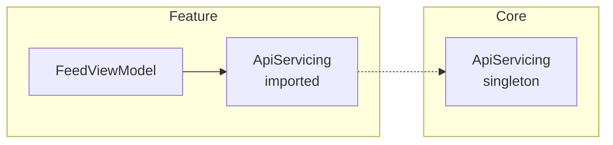

# `ZerkCLI`

`swift package zerk` — Zerk's command-line surface.

This page covers how to get it, every command and option, what the exit codes mean, and the one permission you may need. For what the graph it prints actually *contains*, see [Graph artifact](GraphArtifact.md).

## It is a command plugin, not a build one

Zerk ships two plugins and they are used in opposite ways:

| | `ZerkPlugin` | `ZerkCLI` |
|---|---|---|
| kind | build tool | command |
| when | every build | when you ask |
| setup | attached to each target that declares injectables | nothing |

You never add `ZerkCLI` to a target's `plugins:`. Depending on the Zerk package is enough for the verb to exist:

```bash
swift package plugin --list
# ‘zerk’ (plugin ‘ZerkCLI’ in package ‘Zerk’)
```

In Xcode the same commands appear under the project's plugin menu.

## `swift package zerk`

One verb, with subcommands under it — SwiftPM allows a plugin exactly one verb, so anything finer arrives as an argument. Run bare, it prints the list:

```
Usage: swift package zerk <command> [options]

Commands:
  graph     Export the resolved dependency graph for this package.
  settings  Write ZerkSettings.json from an Xcode target's build settings.
  help      Show this message.

Run 'swift package zerk <command> --help' for a command's options.
```

`help`, `--help` and `-h` are all accepted, at either level:

```bash
swift package zerk                # usage
swift package zerk help           # usage
swift package zerk help graph     # the graph command's options
swift package zerk graph --help   # the same
```

## `zerk graph`

Resolves every target's dependency graph and prints it, [joined across module boundaries](GraphArtifact.md#the-cross-module-view).

```bash
swift package zerk graph                                   # every target, JSON, to stdout
swift package zerk graph --format mermaid                  # paste into a README or PR
swift package zerk graph --format text                     # an inventory, with locations
swift package zerk graph --target AppCore --target Networking --format dot | dot -Tpng -o graph.png
swift package zerk graph --format json --output /tmp/graph.json
```

| Option | Meaning |
|---|---|
| `--target <name>` | Only this target. Repeat for several; the default is all of them |
| `--format <format>` | `text`, `json` (default), `dot`, or `mermaid` |
| `--output <path>` | Write to a file instead of stdout. See [permissions](#writing-a-file) |
| `-h`, `--help` | Show the command's options |

### The formats

**`text`** is a plain listing — one block per module, one line per key, each naming the type behind it and the file and line it is declared on. It is the only format that shows you *where to go*.

**`json`** is the [`ZerkPackageGraph`](GraphArtifact.md#the-cross-module-view) — every module's keys and values, plus the resolved and unresolved imports between them. Pipe it into `jq`.

**`dot`** and **`mermaid`** draw the same picture: one cluster per module, one node per key, solid edges for dependencies within a module and **dashed** ones where an import is answered by another module. Node labels carry the lifetime when there is one worth naming — a transient node is unannotated, because most of them are.



Mermaid renders in GitHub and most Markdown viewers, so it is the one to reach for in a PR. DOT is for `dot -Tpng`, `-Tsvg`, and anything else Graphviz can do.

## `zerk settings`

Reads an Xcode target's build settings and prints the `ZerkSettings.json` that matches them.

```bash
swift package zerk settings --project App.xcodeproj --target App
```

`ZerkSettings.json` exists because the build plugin cannot read build settings — the plugin API
hands it sources and nothing else, and `XcodeTarget` vends `displayName`, `product`,
`dependencies` and `inputFiles` with no settings among them. So the facts have to be restated,
and restating them by hand is where they drift: the file says `"defaultActorIsolation":
"nonisolated"` long after the target moved to `MainActor`, and Zerk then infers the wrong
isolation for every provider. `xcodebuild -showBuildSettings` can read them, and this maps its
answer:

| Build setting | Key |
|---|---|
| `SWIFT_DEFAULT_ACTOR_ISOLATION` | `defaultActorIsolation` |
| `SWIFT_VERSION` | `swiftVersion` |
| `SWIFT_STRICT_CONCURRENCY` | `strictConcurrency` |
| `SWIFT_UPCOMING_FEATURE_ISOLATED_DEFAULT_VALUES` | `isolatedDefaultValues` |

A setting the target does not set is **absent** from xcodebuild's output rather than reported
with a default, so its key is left out and Zerk's own default applies. That keeps the written
file to what the target actually says.

**`valueInjectionMethod` is never written.** It mirrors no build setting — it is Zerk's own
default and yours to choose — so there is nothing to read it from. Re-running this will not
overwrite your answer, and will not carry it over either; merge that key by hand.

### Options

| Option | |
|---|---|
| `--project <path>` | The `.xcodeproj` to read. Required outside Xcode; inside Xcode the open project is used |
| `--target <name>` | Which target's settings. Required when the project has more than one |
| `--output <path>` | Write to a file instead of stdout |

Printing by default is deliberate: the file it replaces is one you may have edited, so the
result is worth reading before adopting. Writing inside the package needs the permission flag,
as [Writing a file](#writing-a-file) describes:

```bash
swift package --allow-writing-to-package-directory \
  zerk settings --project App.xcodeproj --target App --output App/ZerkSettings.json
```

### It needs Xcode

`xcodebuild` is the only thing that can resolve a target's build settings, so this command is
macOS-only and works on an `.xcodeproj` rather than on a Swift package — a package has no such
settings to read. Everything else Zerk does runs anywhere; write the file by hand there.

Refused rather than guessed at: a `SWIFT_STRICT_CONCURRENCY` Zerk does not recognise, or an
upcoming-feature flag that is neither `YES` nor `NO`, is an error naming the build setting. And
whatever it writes is parsed back through Zerk's own loader before you see it, so the command
cannot produce a file the next build rejects.

## It re-runs codegen

The command does **not** read the [`Zerk.graph.json` files a build leaves behind](GraphArtifact.md#where-it-is). It runs `ZerkCodegen` itself, once per target, into its own work directory.

That is deliberate. Those files only exist after a successful build, they are undeclared outputs so nothing guarantees where they are, and finding them means guessing at build-directory layout. Running codegen here instead means the command works on a clean checkout and depends on nothing but your sources.

The cost is small: a codegen pass is parsing plus resolution, not compilation.

## Writing a file

Output goes to **stdout** by default, which pipes and needs no permission at all.

`--output` writes a file. A plugin runs sandboxed, so writing *inside the package* needs SwiftPM's flag:

```bash
swift package zerk graph --format json --output /tmp/graph.json          # outside: fine
swift package --allow-writing-to-package-directory zerk graph \
    --format dot --output ./graph.dot                                    # inside: needs the flag
```

`ZerkCLI` deliberately does **not** declare `permissions:` in its manifest. Doing so would prompt every user for package-write access on every invocation, when the default path never writes anything. Forgetting the flag is not a mystery either — the error names it:

```
error: could not write ./graph.dot: You don't have permission to save the file “graph.dot”…
If that path is inside the package, the plugin needs permission: swift package --allow-writing-to-package-directory zerk graph …
```

## Exit codes

Every failure exits non-zero with a named cause, so the command is usable in CI:

| | Exit |
|---|---|
| success, or any help output | `0` |
| unknown command — `zerk nonsense` | `1` |
| unknown option — `zerk graph --bogus` | `1` |
| unknown target — `zerk graph --target Nope` | `1` |
| missing option value — `zerk graph --format` | `1` |
| codegen failed for a target | `1` |
| refused write | `1` |

A codegen failure prints the same diagnostics a build would, pointing at your source rather than at generated code.

## Verifying it yourself

Zerk's own repository carries a two-module fixture at `Tests/Fixtures/CrossModule` — one
target exporting a key, another importing it. It is a real package, so you can point the
command at it:

```bash
cd Tests/Fixtures/CrossModule
swift package zerk graph --format mermaid
```

The test suite drives the same fixture. `swift test` covers the stitching through the library
on every run; `ZERK_E2E=1 swift test` additionally runs the command above for real, which
takes about a minute and leaves a nested build directory behind.

---

[← Table of contents](../TableOfContents.md)

**See also:** [Graph artifact](GraphArtifact.md) · [How it works](HowItWorks.md) · [Generated code](GeneratedCode.md) · [Diagnostics](Diagnostics.md)
